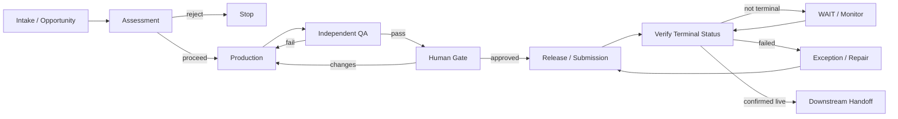
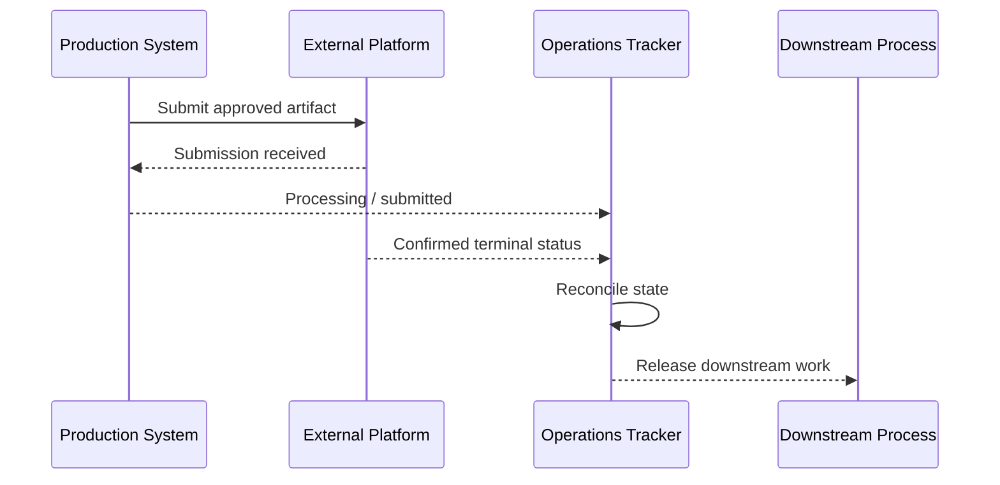

# Human-in-the-Loop AI Production Pipeline

A sanitized case study of an AI-assisted production workflow that combines automation with independent quality control, explicit approval gates, publication verification, and downstream handoffs.

## The Problem

Generating an artifact is only one part of a production system.

A reliable AI-assisted pipeline also has to answer:

- Was the opportunity worth pursuing?
- Did production follow requirements?
- Who checks the result?
- What requires human judgment?
- Did publication actually succeed?
- When is downstream work allowed to begin?
- How does the system distinguish a production failure from a tracking failure?

This architecture was developed around those operational questions.

## Pipeline



## Design Principle

> Completion is an observed state, not an assumption.

The pipeline does not treat "submitted," "sent," or "attempted" as equivalent to successfully released.

Downstream processes should depend on an authoritative terminal condition whenever one is available.

## Stage Contracts

### 1. Intake / Opportunity

Define the proposed artifact, audience, problem, and expected value.

**Exit:** enough information exists for assessment.

### 2. Assessment

Evaluate whether the project should proceed before consuming production resources.

Possible criteria include:

- audience need;
- overlap with existing work;
- practical usefulness;
- scope;
- production feasibility; and
- commercial or operational relevance.

**Exit:** proceed or stop.

### 3. Production

Generate and assemble the artifact according to explicit requirements.

Production may use AI heavily, but requirements should exist outside the model's improvisation.

**Exit:** candidate artifact ready for independent review.

### 4. Independent QA

Check the artifact against requirements rather than asking the producing process whether its own work is good.

QA can examine:

- completeness;
- consistency;
- formatting;
- technical constraints;
- safety or compliance requirements;
- continuity; and
- delivery readiness.

**Exit:** pass or return with specific defects.

### 5. Human Gate

Reserve human judgment for consequential or subjective approval.

The human can approve, reject, or request changes without needing to manually perform routine production steps.

**Exit:** explicit approval.

### 6. Release / Submission

Perform the authorized external action.

Submission itself is **not** the terminal condition.

### 7. Verification

Observe the authoritative external status.

Examples:

- published;
- accepted;
- delivered;
- rejected;
- failed; or
- still processing.

**Exit:** confirmed terminal state or continued monitoring.

### 8. Downstream Handoff

Only after the required terminal condition is satisfied should dependent processes begin.

For example, marketing should not promote an artifact merely because submission was attempted.

## State vs. Execution

One of the important lessons in AI operations is that different systems may disagree about completion.



If the external action succeeds but the operations tracker remains pending, the defect is in reconciliation. Re-running production or resubmitting may make the situation worse.

## Human-in-the-Loop Philosophy

Human gates are most useful where judgment or accountability matters.

They are less useful when a person is forced to repeatedly confirm routine, reversible work that already falls inside established policy.

The pipeline therefore separates:

- **automation** for structured, repeatable work;
- **independent QA** for verification;
- **human judgment** for consequential approval; and
- **terminal verification** for objective completion.

## Failure Modes

### Self-Review Bias

The same generative process produces and approves its own artifact.

**Control:** separate production and QA responsibilities.

### Approval Without Evidence

A human is asked to approve something without the information needed to make the decision.

**Control:** approval packages contain the artifact, relevant requirements, known exceptions, and the exact requested decision.

### Submission Equals Completion

The system treats an attempted external action as success.

**Control:** define an authoritative terminal state.

### Downstream Race

Marketing, notification, or another dependent process starts before release is confirmed.

**Control:** downstream triggers depend on verified terminal status.

### Stale Pending State

Release succeeds but internal tracking remains open.

**Control:** reconciliation consumes authoritative completion signals.

### Infinite Revision Loop

Production and QA cycle without a termination or escalation rule.

**Control:** track defect classes and escalate unresolved or scope-changing issues.

## Example Stage Record

```yaml
artifact_id: example-001
stage: QA
owner: quality-role
requirements_version: v1
authority: review-only
status: in-progress
known_exceptions: []
next_action: validate artifact against release requirements
approval_required: true
terminal_condition: external platform confirms live status
downstream_trigger: terminal_condition
```

## What This Architecture Demonstrates

This case study is less about content generation than **operationalizing AI-generated work**.

It demonstrates:

- stage ownership;
- independent review;
- human approval boundaries;
- external-action controls;
- terminal-state verification;
- downstream dependencies;
- exception routing; and
- reconciliation between systems.

## Design Lessons

### Generating is not shipping

Production quality and operational delivery are separate problems.

### QA should have independent responsibility

A production system benefits from a reviewer whose job is to find defects rather than defend the draft.

### Human approval needs a purpose

A human gate should correspond to judgment, risk, commitment, or accountability—not exist merely because AI was involved.

### External systems are part of the architecture

A workflow is not complete at the API boundary. Real operational state includes what the external service actually did.

### Downstream automation should be evidence-driven

Dependent work begins from verified state rather than optimistic assumptions.

## Scope

This repository is a sanitized architecture case study derived from a real AI-assisted production workflow.

It intentionally excludes unpublished artifacts, proprietary prompts, account credentials, customer information, platform secrets, and internal production configuration.

---

**William "Billy" VanVorst**  
Applied AI Systems & Automation  
Founder, bVan! Systems
